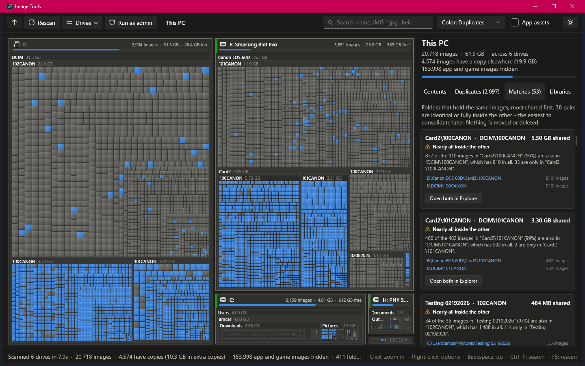

# Image Tools

A fast, read-only Windows app that finds every photo and image on your drives, shows where they live as an interactive treemap, and finds the duplicates.

**No ads, no spyware, no installer. Just a simple tool that shows where your photos are and which ones you have twice.** It never connects to the internet and never changes your files.

> **Beta.** This is an early pre-release. It only reports: nothing is moved, copied, renamed or deleted. A future *Consolidate* step will build on what it finds.



## Features

- **Every image on every drive.** JPEG, PNG, HEIC/HEIF, WebP, AVIF, GIF, TIFF, BMP, Photoshop and camera RAW files (CR2, CR3, NEF, ARW, DNG, ORF, RW2, RAF and more). Folders without images are left out, so the map is only about your pictures.
- **App and game images stay out of the way.** Icons, textures and other images that belong to programs are recognized by where they live (Windows, Program Files, AppData, game libraries, code projects, caches) or by being tiny. They're scanned but hidden; tick **App assets** to show them. Hover one to see why it was hidden.
- **Libraries.** Camera folders (DCIM, 100CANON…), screenshots, messaging apps (WhatsApp, Telegram…), Downloads, Pictures, Desktop and Documents, backups and exports, and the Recycle Bin are recognized by name. The **Libraries** tab lists them, and **Color: Library** shows them on the map.
- **Exact duplicates.** Images are compared byte for byte in stages, so most files are never read in full: same size, then the same first 64 KB, then the same SHA-256 of the whole file. The **Duplicates** tab lists them by wasted space, and hovering a duplicate outlines its copies on the map.
- **Folder matches.** Finds folders that hold the same images, such as a camera folder copied twice where one copy has 300 more photos. Pairs that are identical, or entirely inside another folder, come first: they're the easiest to consolidate.
- **Photo details for later.** Date taken, camera, dimensions, star rating and Windows tags are read through the Windows property system (the same values Explorer shows) and kept with each image, along with its folder.
- **Fast rescans.** Hashes and details are cached next to the exe, keyed on each file's size and date, so a rescan only reads files that changed.
- **Cloud-safe.** Online-only OneDrive and cloud-sync files are listed by name and size but never opened, so nothing is downloaded. Network and cloud drives are skipped unless you include them from the **Drives** menu.
- **Run as admin (optional).** One click restarts the app elevated, so folders a normal user can't read are included. Still read-only.
- **Same look as Disk Visualizer.** Drive frames with health strips and capacity bars, search with wildcards, light and dark themes, previews in the tooltip, and the same keyboard shortcuts.

## Running it

### Portable exe

Build one self-contained exe that runs on any 64-bit Windows 10/11 PC, with nothing to install:

```powershell
dotnet publish -p:PublishProfile=Portable
```

This writes `publish/ImageTools.exe`, which you can copy anywhere, such as a USB stick. Settings are saved next to it in `ImageTools.settings.json` and the hash cache in `ImageTools.cache`; if that folder isn't writable, both go to `%LocalAppData%\ImageTools` instead.

### From source

Building requires the [.NET 10 SDK](https://dotnet.microsoft.com/download/dotnet/10.0).

```powershell
dotnet run -c Release
```

## Notes and limits

- Duplicates are **byte-identical** files only. The same photo with edited metadata, resized or re-saved copies, and a HEIC with its exported JPEG aren't matched yet. A RAW file and the JPEG the camera saved alongside it are separate images, not duplicates.
- App-asset detection goes by folder names and file size, so it's a best guess. Images inside a folder with a `.git`, `package.json`, `project.godot`, `.sln` or similar are treated as project assets.
- Windows Photos "favorites" (hearts) live in the Photos app's own database, not in the file, so they aren't read. Star ratings and tags stored in the file are.
- HEIC, WebP, AVIF and RAW previews and details need the matching Windows codec extensions.
- The cache file lists image paths, tags and camera names. It stays on your PC; delete it at any time to start fresh.
- Hard-linked files would show as duplicates even though they share one copy on disk.

## Code layout

| Path | What it does |
|---|---|
| `src/Scanning/DriveScanner.cs` | Multi-threaded directory scan that keeps only images and classifies folders as it goes |
| `src/Scanning/Analyzer.cs` | Duplicate check (size → first 64 KB → SHA-256), folder matches, and photo details |
| `src/Model/Libraries.cs` | Folder-name rules for libraries and app assets |
| `src/Model/` | Tree nodes, image formats, duplicate groups, search and formatting |
| `src/Platform/` | Hash cache, Windows property reader, previews, elevation, disks and settings |
| `src/Treemap/` | Squarified treemap drawing and hit testing, and the color theme |
| `MainWindow.xaml(.cs)` | Toolbar, side panel, cards, tooltips and navigation |
| `DESIGN.md` | The design language shared with Disk Visualizer |
